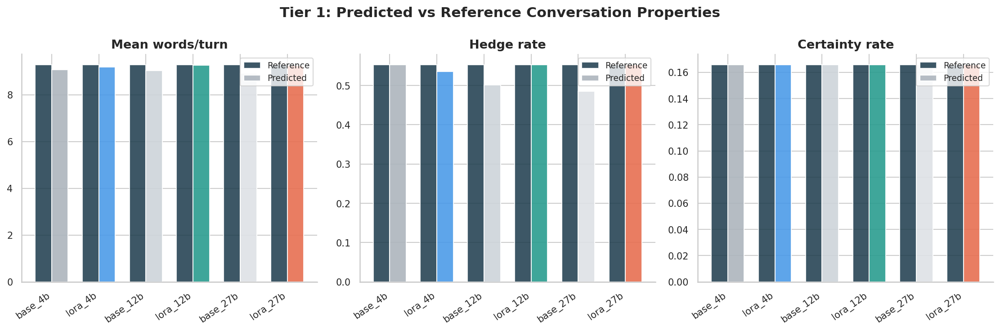
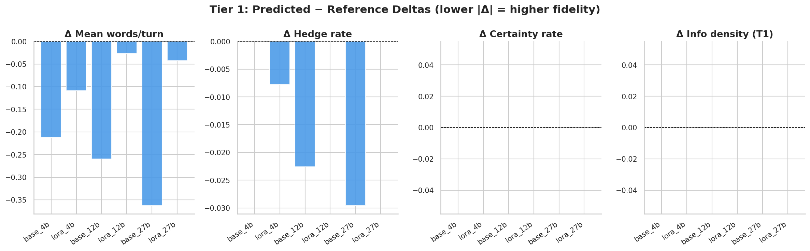
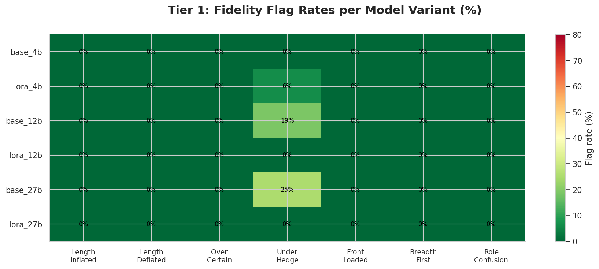

# Conversation-Level Fidelity Evaluation Report

Evaluates whether reconstructed predicted conversations reproduce the human-realism properties of the reference conversations. Each conversation is reconstructed by ordering the predicted turns for a given `(model_variant, generation_idx)` pair and comparing them as a sequence against the equivalent reference turns.

**Conversations evaluated:** 16 unique conversations × 6 model variants = 96 total  
**Available tiers:** Tier 1 Rule-Based Fidelity  
**Source files:** `conversation_predictions_t1.csv` · `images/cp_*.png`

> **How to read this report:** Tier 1 metrics compare predicted vs reference turn sequences using rule-based checks. Δ values are (predicted − reference): values close to zero indicate high fidelity. Fidelity flags are raised when a dimension deviates beyond a calibrated threshold.

---

## 1. Conversation-Level Tier 1 — Rule-Based Fidelity

Rule-based metrics computed on reconstructed predicted conversations and their reference counterparts. Δ = predicted − reference. Flags are raised when the predicted conversation deviates meaningfully from reference behaviour on that dimension.

### A. Length & Lexical Deltas

| Model | ΔWords/turn | ΔHedge/turn | ΔCertainty/turn | ΔPromise/turn |
|-------|------------|------------|----------------|--------------|
| base_4b | -0.212 | +0.000 | +0.000 | +0.000 |
| lora_4b | -0.109 | -0.008 | +0.000 | +0.000 |
| base_12b | -0.260 | -0.023 | +0.000 | +0.000 |
| lora_12b | -0.027 | +0.000 | +0.000 | +0.000 |
| base_27b | -0.363 | -0.030 | +0.000 | +0.000 |
| lora_27b | -0.043 | +0.000 | +0.000 | +0.000 |

> Negative ΔWords = model generates shorter turns than reference. Negative ΔHedge = model under-hedges relative to reference (less tentative). Positive ΔCertainty = model over-commits relative to reference.

### B. Information Density

| Model | Pred InfoDensity | Ref InfoDensity | Δ | BF Pred % | BF Ref % |
|-------|----------------|----------------|---|----------|---------|
| base_4b | 0.167 | 0.167 | +0.000 | 12.5% | 12.5% |
| lora_4b | 0.167 | 0.167 | +0.000 | 12.5% | 12.5% |
| base_12b | 0.167 | 0.167 | +0.000 | 12.5% | 12.5% |
| lora_12b | 0.167 | 0.167 | +0.000 | 12.5% | 12.5% |
| base_27b | 0.167 | 0.167 | +0.000 | 12.5% | 12.5% |
| lora_27b | 0.167 | 0.167 | +0.000 | 12.5% | 12.5% |

> InfoDensity = fraction of key facts (merchant / amount / date) volunteered in the first customer turn. BF % = fraction of conversations where the model bundles 2+ concern categories in a single turn (breadth-first tell).

### C. Fidelity Flags

Fraction of conversations where the predicted sequence raises each flag. Lower = better fidelity.

| Model | LenInflated | LenDeflated | OverCertain | UnderHedge | FrontLoad | BreadthNew | RoleConf |
|---|---|---|---|---|---|---|---|
| base_4b | 0.0% | 0.0% | 0.0% | 0.0% | 0.0% | 0.0% | 0.0% |
| lora_4b | 0.0% | 0.0% | 0.0% | 6.2% | 0.0% | 0.0% | 0.0% |
| base_12b | 0.0% | 0.0% | 0.0% | 18.8% | 0.0% | 0.0% | 0.0% |
| lora_12b | 0.0% | 0.0% | 0.0% | 0.0% | 0.0% | 0.0% | 0.0% |
| base_27b | 0.0% | 0.0% | 0.0% | 25.0% | 0.0% | 0.0% | 0.0% |
| lora_27b | 0.0% | 0.0% | 0.0% | 0.0% | 0.0% | 0.0% | 0.0% |

_cp_01: Predicted vs reference mean words/turn, hedge rate, certainty rate. cp_02: Delta bar charts (pred − ref) for key metrics. cp_03: Fidelity flag heatmap — darker = more flags raised._

---

## 2. Metric Interpretation Guide

This section covers what each metric family captures in the conversation-level report and where it has limitations.

### Tier 1 — Rule-Based Fidelity

**What it measures:** Five dimensions of conversation-level human realism, compared between predicted and reference turn sequences:
- **Length & lexical deltas** — whether the model generates turns of similar length and uses hedging/certainty language at the same rate as the reference
- **Information density** — whether the model front-loads key facts (merchant, amount, date) in the first turn at the same rate as the reference. High front-loading is an LLM tell (Wang et al. 2025)
- **Breadth-first bundling** — whether the model raises multiple concern categories (dispute + refund + card action) in the same turn, as LLMs tend to do
- **Persona signals** — whether emotional markers and banking jargon are present at the same rate as in the reference
- **Fidelity flags** — binary flags raised when a dimension deviates beyond a calibrated threshold; flag count is the primary fidelity health signal

**Strengths:** Fast, deterministic, interpretable, no API cost. Flag counts give a single at-a-glance fidelity health score per conversation.

**Weaknesses:** Phrase-list detection has limited coverage. Thresholds (±15% length, ±0.10 hedge rate) were calibrated for this dataset and may need adjustment as data scale grows. Metrics are computed on customer turns only — agent turns are not reconstructed.

**Recommendation:** Use flag counts as the primary Tier 1 signal. Investigate conversations with ≥3 flags manually. `flag_under_hedge` and `flag_role_confused` are the most diagnostic for UserLM quality.

---
