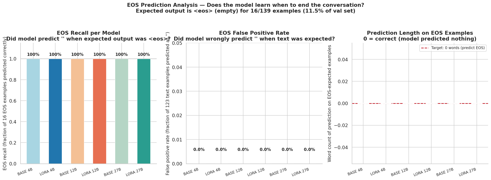
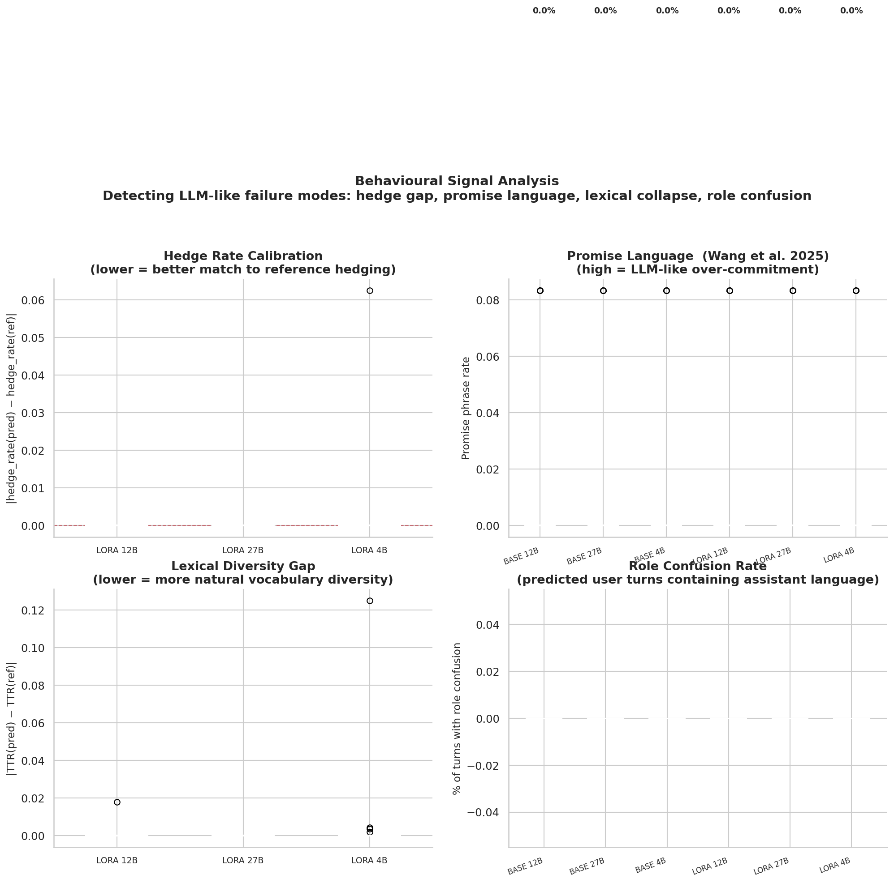
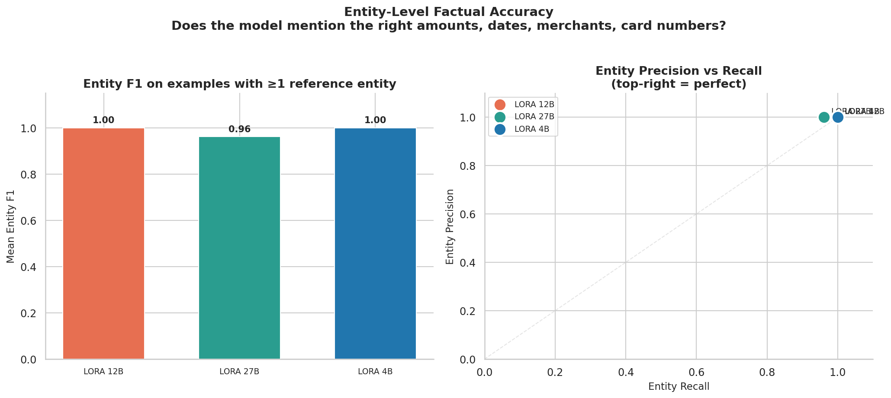
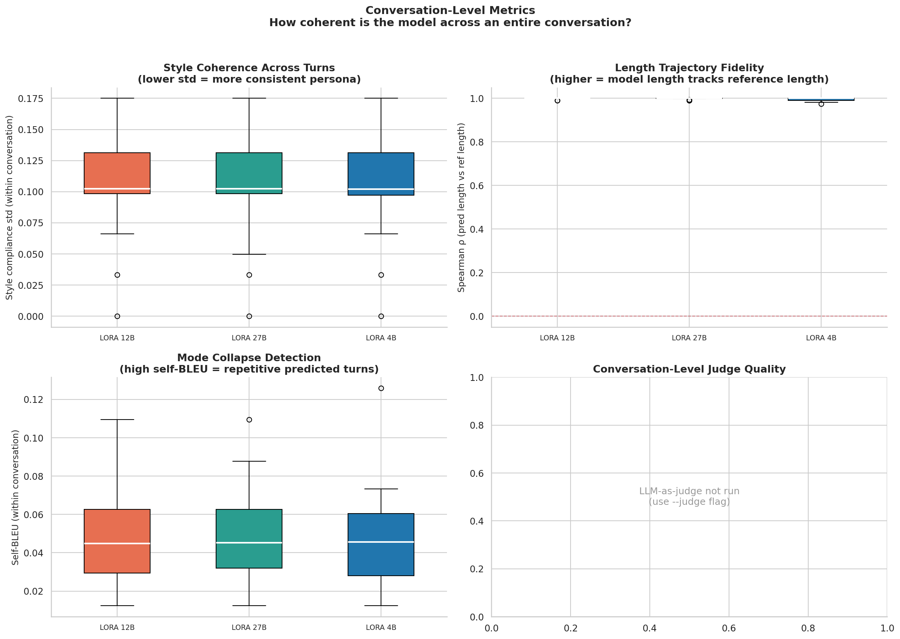
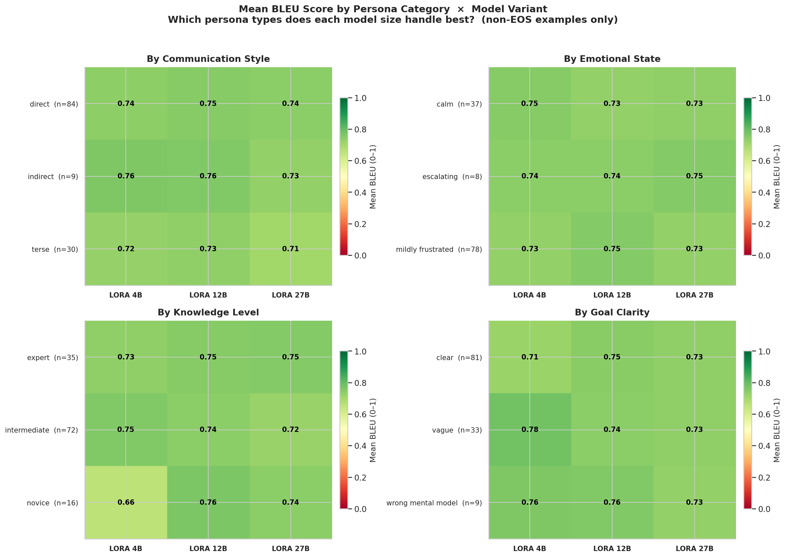
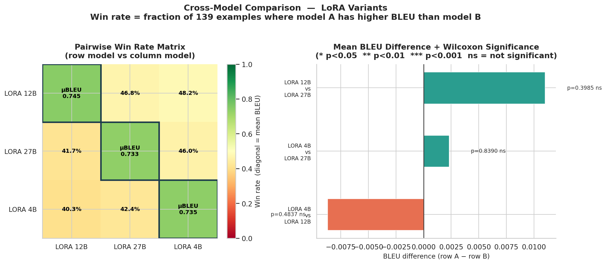
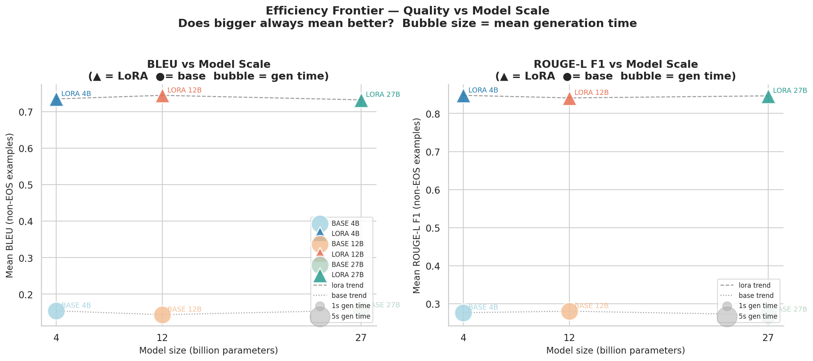
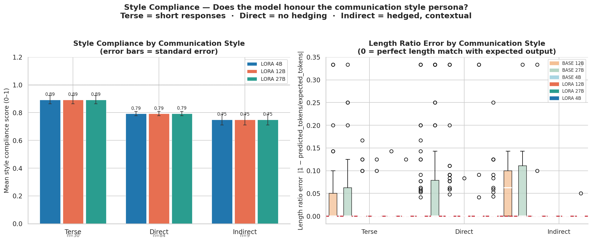

# Turn-Level Prediction Evaluation Report

Evaluates the fidelity of UserLM-generated turns against reference turns, one turn at a time. Each row in the underlying data is a single predicted customer turn paired with its reference. Metrics are aggregated across all 139 validation examples (16 EOS · 123 text).

**Model variants evaluated:** 6 (3 LoRA fine-tuned + 3 base)  
**Primary metric:** METEOR  
**Available metrics:** METEOR · BLEU · Entity P/R/F1 · Behavioural Signals · Conversation Trajectories  
**Source files:** `prediction_metrics_detailed.csv` · `category_summary.csv` · `model_comparison.csv` · `conversation_metrics.csv`

---

## 1. Overall Performance

Primary semantic metric: **METEOR** (first available in hierarchy: BERTScore F1 → BLEURT → METEOR → BLEU). Surface lexical metrics (BLEU, ROUGE) are shown for reference but should not be interpreted as primary indicators of generation quality.

| Model | N | METEOR | BLEU | Exact Match | EOS Recall | Style Compliance |
|---|---|---|---|---|---|---|
| base_4b | 139 | 0.941 | 0.154 | 81.3% | 100.0% | 0.836 |
| lora_4b | 139 | 0.955 | 0.735 | 89.9% | 100.0% | 0.836 |
| base_12b | 139 | 0.932 | 0.144 | 76.3% | 100.0% | 0.834 |
| lora_12b | 139 | 0.965 | 0.745 | 97.8% | 100.0% | 0.836 |
| base_27b | 139 | 0.911 | 0.156 | 66.9% | 100.0% | 0.834 |
| lora_27b | 139 | 0.960 | 0.733 | 96.4% | 100.0% | 0.836 |

> **Best LoRA variant by METEOR:** `lora_12b` (METEOR = 0.965)

---

## 2. EOS Prediction Analysis

EOS examples are turns where the expected output is `<eos>` — the conversation should end. Correct prediction = empty string.

| Model | EOS examples | EOS Recall | False Positive Rate |
|-------|-------------|------------|---------------------|
| base_4b | 16 | 100.0% | 0.0% |
| lora_4b | 16 | 100.0% | 0.0% |
| base_12b | 16 | 100.0% | 0.0% |
| lora_12b | 16 | 100.0% | 0.0% |
| base_27b | 16 | 100.0% | 0.0% |
| lora_27b | 16 | 100.0% | 0.0% |

> All models correctly predicted EOS for every EOS example.

_Panel A: EOS recall per model. Panel B: false positive rate. Panel C: word-count distribution on EOS-expected examples (0 words = correct)._

---

## 3. Behavioural Signals

Behavioural metrics capture pragmatic properties of generated text that lexical metrics miss. These are inspired by Wang et al. (2025) findings that LLM-generated user utterances systematically under-hedge and over-promise compared to real humans.

| Model | Hedge Δ | Promise Δ | TTR Δ |
|---|---|---|---|
| base_4b | +0.000 | +0.000 | +0.002 |
| lora_4b | +0.001 | +0.000 | +0.001 |
| base_12b | +0.002 | +0.000 | +0.001 |
| lora_12b | +0.000 | +0.000 | +0.000 |
| base_27b | +0.002 | +0.000 | +0.002 |
| lora_27b | +0.000 | +0.000 | +0.000 |

> **Reading the deltas:** Hedge Δ and Promise Δ are (predicted − reference). Negative hedge Δ = model under-hedges vs reference. Positive promise Δ = model over-promises. TTR Δ measures vocabulary diversity shift. Role confusion = fraction of turns where the model produces assistant-like language.

_Behavioural signal distributions across model variants. Closer to zero delta = better alignment with reference behaviour._

---

## 4. Entity Analysis

Regex-based extraction and comparison of banking-domain entities: amounts ($X.XX), dates, card numbers (last 4 digits), and merchant names. Measures whether the model preserves factual details from the conversation context.

| Model | Entity Precision | Entity Recall | Entity F1 |
|-------|-----------------|---------------|-----------|
| base_4b | 1.000 | 1.000 | 1.000 |
| lora_4b | 1.000 | 1.000 | 1.000 |
| base_12b | 1.000 | 0.996 | 0.997 |
| lora_12b | 1.000 | 1.000 | 1.000 |
| base_27b | 1.000 | 0.992 | 0.992 |
| lora_27b | 1.000 | 0.992 | 0.992 |

_Entity-level precision, recall, and F1 across model variants. Low precision = entity hallucination; low recall = entity omission._

---

## 5. Conversation-Level Metrics

Metrics computed per conversation (grouped by generation_idx), capturing cross-turn coherence and consistency — the properties that turn-level metrics cannot measure.

| Model | Convs | Style σ | Style min | Self-BLEU | Hedge ρ | Length ρ | Role confused turns |
|---|---|---|---|---|---|---|---|
| base_4b | 16 | 0.106 | 0.695 | 0.049 | 1.000 | 0.991 | 0 |
| lora_4b | 16 | 0.106 | 0.697 | 0.048 | 0.997 | 0.995 | 0 |
| base_12b | 16 | 0.105 | 0.701 | 0.048 | 0.948 | 0.994 | 0 |
| lora_12b | 16 | 0.106 | 0.695 | 0.047 | 1.000 | 0.999 | 0 |
| base_27b | 16 | 0.107 | 0.695 | 0.051 | 0.912 | 0.989 | 0 |
| lora_27b | 16 | 0.105 | 0.698 | 0.049 | 1.000 | 0.998 | 0 |

> **Reading this table:** Style σ = standard deviation of style compliance within a conversation (lower = more consistent). Self-BLEU = pairwise BLEU among predicted turns in the same conversation (very high values suggest mode collapse / repetitive outputs). Hedge ρ / Length ρ = Spearman correlation between predicted and reference trajectories across conversation turns (higher = better tracking of conversational dynamics).

_Conversation-level metrics distributions. These capture cross-turn coherence that single-turn metrics cannot measure._

---

## 6. Performance by Persona Category

METEOR scores broken down by persona attribute (LoRA variants, non-EOS examples only).

### Communication Style

| Communication Style | lora_4b | lora_12b | lora_27b |
|---|---|---|---|
| direct | 0.962 | 0.973 | 0.965 |
| indirect | 0.955 | 0.998 | 0.998 |
| terse | 0.936 | 0.934 | 0.936 |

> Easiest: **indirect** (avg METEOR 0.983)  · Hardest: **terse** (avg METEOR 0.935)

### Emotional State

| Emotional State | lora_4b | lora_12b | lora_27b |
|---|---|---|---|
| calm | 0.937 | 0.945 | 0.947 |
| escalating | 0.975 | 0.989 | 0.985 |
| mildly_frustrated | 0.961 | 0.973 | 0.964 |

> Easiest: **escalating** (avg METEOR 0.983)  · Hardest: **calm** (avg METEOR 0.943)

### Knowledge Level

| Knowledge Level | lora_4b | lora_12b | lora_27b |
|---|---|---|---|
| expert | 0.934 | 0.944 | 0.936 |
| intermediate | 0.956 | 0.969 | 0.964 |
| novice | 0.995 | 0.995 | 0.995 |

> Easiest: **novice** (avg METEOR 0.995)  · Hardest: **expert** (avg METEOR 0.938)

### Goal Clarity

| Goal Clarity | lora_4b | lora_12b | lora_27b |
|---|---|---|---|
| clear | 0.947 | 0.950 | 0.948 |
| vague | 0.975 | 0.993 | 0.981 |
| wrong_mental_model | 0.955 | 0.998 | 0.998 |

> Easiest: **wrong_mental_model** (avg METEOR 0.983)  · Hardest: **clear** (avg METEOR 0.948)

_Heatmap of mean METEOR per persona attribute × LoRA model variant._

---

## 7. Cross-Model Comparison

Pairwise win rates and Wilcoxon signed-rank test significance (paired, non-parametric). Win rate = fraction of examples where model A outscores model B on BLEU.

| Model A | Model B | A win rate | B win rate | Tie rate | Δ BLEU (A−B) | p-value | Significant |
|---------|---------|-----------|-----------|----------|------------|---------|------------|
| lora_4b | lora_12b | 40.3% | 48.2% | 11.5% | -0.0087 | 0.4837 | ns |
| lora_4b | lora_27b | 42.4% | 46.0% | 11.5% | +0.0023 | 0.8390 | ns |
| lora_12b | lora_27b | 46.8% | 41.7% | 11.5% | +0.0110 | 0.3985 | ns |
| base_4b | lora_4b | 0.0% | 88.5% | 11.5% | -0.5141 | 0.0000 | *** |
| base_4b | base_12b | 46.8% | 41.7% | 11.5% | +0.0094 | 0.4006 | ns |
| base_4b | lora_12b | 0.0% | 88.5% | 11.5% | -0.5228 | 0.0000 | *** |
| base_4b | base_27b | 46.0% | 42.4% | 11.5% | -0.0015 | 0.9829 | ns |
| base_4b | lora_27b | 0.0% | 88.5% | 11.5% | -0.5118 | 0.0000 | *** |
| lora_4b | base_12b | 88.5% | 0.0% | 11.5% | +0.5235 | 0.0000 | *** |
| lora_4b | base_27b | 88.5% | 0.0% | 11.5% | +0.5126 | 0.0000 | *** |
| base_12b | lora_12b | 0.0% | 88.5% | 11.5% | -0.5322 | 0.0000 | *** |
| base_12b | base_27b | 43.9% | 44.6% | 11.5% | -0.0109 | 0.3312 | ns |
| base_12b | lora_27b | 0.0% | 88.5% | 11.5% | -0.5212 | 0.0000 | *** |
| lora_12b | base_27b | 88.5% | 0.0% | 11.5% | +0.5213 | 0.0000 | *** |
| base_27b | lora_27b | 0.0% | 88.5% | 11.5% | -0.5103 | 0.0000 | *** |

> **Note:** This comparison uses BLEU for pairwise ranking because it was the metric used in the Wilcoxon test. See sections above for semantic and judge-based comparisons.

_Left: pairwise win-rate matrix (diagonal = mean score). Right: mean difference with Wilcoxon significance markers._

---

## 8. Efficiency Frontier

Mean METEOR vs model scale (parameters). Bubble size reflects mean generation time.

| Model | Params (B) | METEOR | METEOR | Mean gen time (s) |
|-------|-----------|-----------|--------|-------------------|
| base_4b | 4 | 0.941 | 0.941 | 3.995 |
| lora_4b | 4 | 0.955 | 0.955 | 2.758 |
| base_12b | 12 | 0.932 | 0.932 | 3.959 |
| lora_12b | 12 | 0.965 | 0.965 | 2.724 |
| base_27b | 27 | 0.911 | 0.911 | 4.119 |
| lora_27b | 27 | 0.960 | 0.960 | 2.786 |

> `lora_4b` outperforms `base_4b` by 0.0139 METEOR points.

> `lora_12b` outperforms `base_12b` by 0.0329 METEOR points.

> `lora_27b` outperforms `base_27b` by 0.0489 METEOR points.

_Scatter plots of quality metric against model size. Triangles = LoRA fine-tuned, circles = base._

---

## 9. Style Compliance

Rule-based check of whether predictions match the persona's communication style. Terse = ≤12 words, Direct = ≤20 words, Indirect = ≥8 words with hedging language. Score 0–1 (higher = more compliant).

| Style | lora_4b | lora_12b | lora_27b |
|-------|---|---|---|
| direct | 0.817 | 0.817 | 0.817 |
| indirect | 0.775 | 0.775 | 0.775 |
| terse | 0.906 | 0.906 | 0.906 |

> Hardest: **indirect** (avg 0.775) · Easiest: **terse** (avg 0.906)

_Left: style compliance per communication style × model. Right: length ratio error distribution per style._

---

## 10. Loss & Perplexity

Mean cross-entropy loss and perplexity across all examples (including EOS).

| Model | Mean Loss | Mean Perplexity |
|-------|-----------|----------------|
| base_4b | 2.865 | 179.248 |
| lora_4b | 0.463 | 3.068 |
| base_12b | 2.777 | 166.819 |
| lora_12b | 0.446 | 2.997 |
| base_27b | 2.812 | 172.665 |
| lora_27b | 0.449 | 2.987 |

---

## 11. Metric Interpretation Guide

This section summarises what each metric family captures and where it falls short, to help interpret the results above correctly.

### Lexical Metrics (BLEU, ROUGE-L, METEOR)

**Strengths:**

- Fast to compute, deterministic, widely reported — useful as baselines for comparability with other work
- METEOR improves over BLEU by accounting for synonyms and stemming

**Weaknesses:**

- BLEU and ROUGE measure n-gram overlap only — a semantically correct paraphrase can score near zero if it uses different words
- Particularly unreliable for short conversational turns (1–3 sentences) where word choice varies naturally
- BLEU scores in this dataset may be inflated or deflated by `<eos>` token handling in the upstream pipeline

**Recommendation:** Treat BLEU/ROUGE as secondary reference metrics. Do not use them as the primary basis for model selection decisions.

### Entity Precision / Recall / F1

**Strengths:**

- Directly measures factual fidelity — whether the model preserves amounts, dates, card numbers, and merchant names from the conversation context
- Cheap to compute (regex-based), interpretable, and domain-specific

**Weaknesses:**

- Regex extraction is brittle — may miss entities in unusual formats or extract false positives from surrounding text
- Only covers a fixed set of entity types; adding new types requires manual regex work
- Many conversational turns contain zero entities, making the metric undefined (scored as 1.0 precision/recall by convention)

**Recommendation:** Focus on turns where `entity_count_ref > 0`. Low entity recall is a strong signal of information loss; low precision signals hallucinated details.

### Behavioural Signals (Hedge Rate, Promise Rate, TTR, Role Confusion)

**Strengths:**

- Captures pragmatic properties invisible to all other metrics — whether the model sounds like a *user* rather than an *assistant*
- Role confusion detection directly flags the most dangerous failure mode for a UserLM: producing assistant-like language
- Hedge and promise rate deltas are grounded in empirical findings from Wang et al. (2025) on real human–LLM behavioural divergences

**Weaknesses:**

- Phrase-list based detection (hedges, promises) has limited coverage — novel hedging strategies will be missed
- TTR is sensitive to text length; short turns inflate TTR
- Role confusion regex may flag legitimate user phrases that happen to overlap with assistant language (e.g., "I can provide" in a business-savvy persona)

**Recommendation:** Role confusion rate is a hard diagnostic — any non-zero value warrants manual inspection. Hedge/promise deltas are directional indicators: systematic negative hedge Δ or positive promise Δ suggests the model has not fully learned human pragmatic patterns.

### Conversation-Level Metrics (Self-BLEU, Trajectory Correlations)

**Strengths:**

- Only metric family that captures cross-turn coherence — essential for evaluating a UserLM that must maintain persona consistency across a full conversation
- Self-BLEU is a direct mode-collapse detector: high values mean the model is producing repetitive turns within a conversation
- Trajectory correlations (hedge ρ, length ρ) measure whether the model tracks the natural escalation/de-escalation dynamics of a conversation

**Weaknesses:**

- Requires enough turns per conversation to be meaningful (conversations with ≤2 text turns produce unreliable correlations)
- Spearman ρ can be undefined or misleading when all values in a trajectory are identical (e.g., hedge rate = 0 for all turns)
- These metrics are computed against *synthetic reference conversations*, not real human conversations — the reference trajectory itself may not be realistic

**Recommendation:** Focus on Self-BLEU for mode collapse detection and style compliance σ for consistency. Trajectory correlations are most informative for longer conversations (5+ turns).

### Loss & Perplexity

**Strengths:**

- Direct training objective — the most granular signal of how well the model has learned the target distribution at the token level
- Perplexity is comparable across model sizes when computed on the same data

**Weaknesses:**

- Low perplexity does not guarantee high-quality text — the model could have low perplexity by always predicting safe, generic responses
- Perplexity values can be dominated by common tokens (articles, prepositions) rather than the information-carrying words
- Very large perplexity values (>10,000) often indicate a computation bug (loss summed rather than averaged before exponentiation)

**Recommendation:** Use loss curves for training diagnostics (overfitting detection) but not for model selection. Validate against generation-quality metrics above.

### Style Compliance

**Strengths:**

- Directly measures a core UserLM requirement: does the model match the persona's communication style (terse/direct/indirect)?
- Cheap, deterministic, and interpretable

**Weaknesses:**

- Rule-based thresholds (e.g., terse = ≤12 words) are arbitrary and may not capture the full range of valid stylistic expression
- Binary compliance misses degree — a 13-word 'terse' response is scored the same as a 50-word response

**Recommendation:** Use alongside length ratio error for a more nuanced view. Style compliance is most useful for identifying categorical failures (e.g., indirect persona generating terse responses).

---
