# Synthetic Conversation Evaluation Report

> **Layer 1** — rule-based heuristic checks (eval_conversations.py)  
> **Layer 2** — LLM-as-judge behavioural scoring (eval_layer2.py)

---

## 1. Executive Summary

| Metric | Value |
|--------|-------|
| Conversations evaluated (Layer 1) | 221 |
| Avg warnings per conversation | 0.98 |
| Outliers (≥ 3 warnings) | 6 (3%) |
| Conversations scored (Layer 2) | 221 |
| Avg overall score (1–5 scale) | 4.38 |
| Judge model | claude-sonnet-4-6 |

Overall quality assessment: **Good** — most conversations score above 3.5 on the human-likeness scale.

---

## 2. Dataset Composition

| Dataset Type | Count | % of Total |
|--------------|-------|------------|
| `failure` | 70 | 32% |
| `success` | 80 | 36% |
| `type_a` | 40 | 18% |
| `type_b` | 31 | 14% |
| **Total** | **221** | 100% |

**Emotional State:** `mildly_frustrated` 101  |  `calm` 96  |  `escalating` 24  
**Knowledge Level:** `intermediate` 135  |  `expert` 54  |  `novice` 32  
**Communication Style:** `direct` 117  |  `terse` 72  |  `indirect` 32  
**Goal Clarity:** `clear` 158  |  `wrong_mental_model` 32  |  `vague` 31  

---

## 3. Layer 1 — Rule-Based Evaluation

### 3A. Warning Overview

Each conversation is checked across five dimensions (A–E) plus type-specific checks (F). Each triggered check adds one warning. Conversations with ≥ 3 warnings are flagged as outliers.

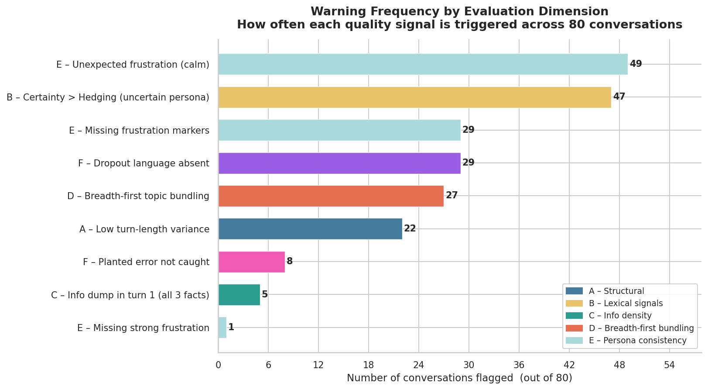

| Warning | Conversations Flagged | % |
|---------|----------------------|---|
| E – Unexpected frustration (calm persona) | 49 | 22% |
| B – Certainty rate > hedge rate (uncertain persona) | 47 | 21% |
| E – Missing frustration markers | 29 | 13% |
| F – Dropout language absent | 29 | 13% |
| D – Breadth-first topic bundling | 27 | 12% |
| A – Low turn-length variance (stddev < 3) | 22 | 10% |
| F – Planted agent error not caught | 8 | 4% |
| C – All 3 facts in turn 1 (info dump) | 5 | 2% |
| E – Missing strong frustration (very_upset/escalating) | 1 | 0% |

### 3B. Structural Stats

Measures of customer turn length and count per conversation. Very long average turns (> 30 words) or unnaturally uniform turn lengths (stddev < 3.0) are flagged.

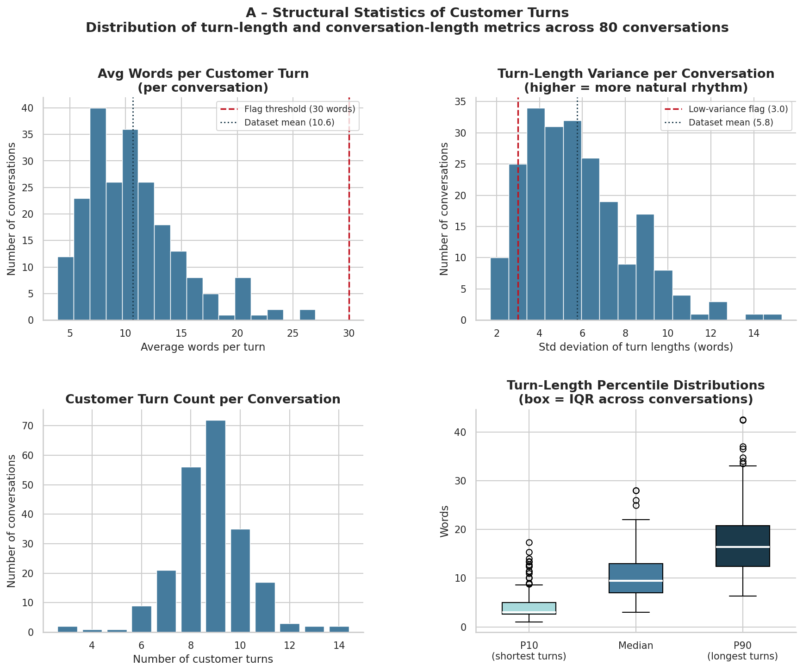

| Metric | Mean | Min | Max | Stdev |
|--------|------|-----|-----|-------|
| Avg words / turn | 10.64 | 3.90 | 27.00 | 4.28 |
| Turn-length stddev | 5.76 | 1.70 | 15.30 | 2.40 |
| Customer turns / conv | 8.77 | 3.00 | 14.00 | 1.56 |
| P90 words / turn | 17.41 | 6.30 | 42.60 | 6.80 |

- Conversations with HIGH_AVG_TURN_LENGTH (> 30 words): **0 (0%)**
- Conversations with LOW_LENGTH_VARIANCE (stddev < 3.0): **22 (10%)**

### 3C. Lexical Signals — Hedging vs Over-Certainty

Real humans hedge uncertainty ("I think", "not sure", "maybe"). LLM-generated users over-commit with words like "definitely", "absolutely", "certainly" (Wang et al. 2025). A positive **hedge − certainty** score is human-like.

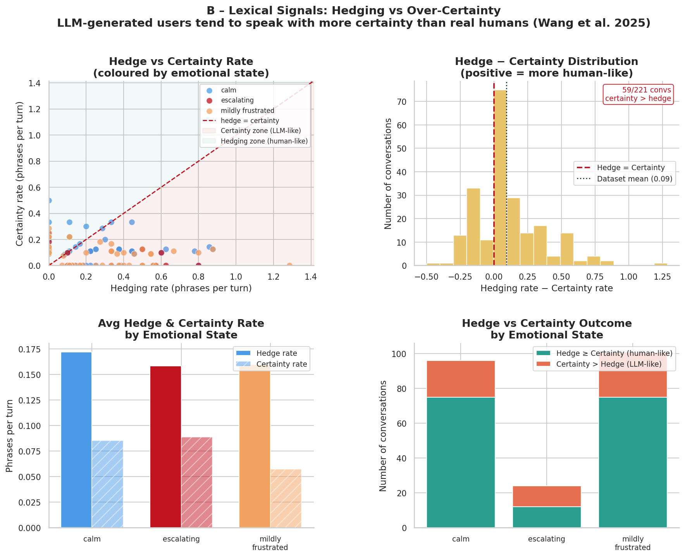

| Metric | Mean | Min | Max |
|--------|------|-----|-----|
| Hedge rate (phrases / turn) | 0.165 | 0.000 | 1.286 |
| Certainty rate (phrases / turn) | 0.073 | 0.000 | 0.500 |
| Hedge − Certainty | 0.092 | -0.500 | 1.286 |

- Certainty > Hedging (uncertain persona): **47 (21%)**
- Zero hedging in uncertain scenario: **0 (0%)**

### 3D. First-Turn Information Density

Checks how many of the three key facts — merchant, amount, transaction date — the customer volunteers unprompted in their very first turn. Volunteering all three at once is LLM-like; real customers drip information gradually.

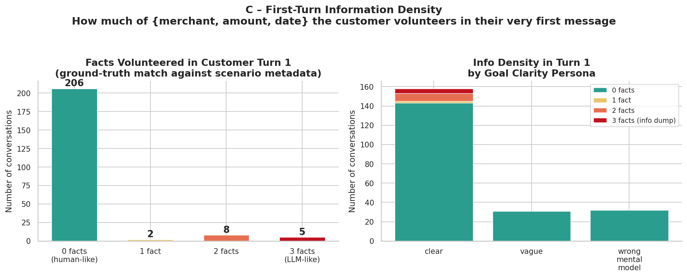

| Facts in Turn 1 | Count | % | Assessment |
|-----------------|-------|---|------------|
| 0 | 206 | 93% | Human-like |
| 1 | 2 | 1% | Acceptable |
| 2 | 8 | 4% | Borderline |
| 3 | 5 | 2% | LLM-like (flag) |

Info-dump rate (all 3 facts in turn 1): **5 (2%)**

### 3E. Breadth-First Topic Bundling

Real users raise one concern at a time (depth-first). LLM-generated users bundle multiple concerns — dispute + card cancel + refund ETA — into a single message (breadth-first). Flagged when max concern-categories in any single turn ≥ 3, or when ≥ 2 turns contain multiple categories.

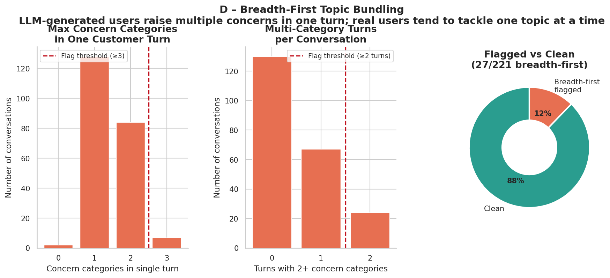

| Metric | Mean | Max |
|--------|------|-----|
| Max concern-categories in one turn | 1.43 | 3 |
| Turns with 2+ concern categories   | 0.52 | 2 |

Breadth-first flagged: **27 (12%)**

### 3F. Persona Consistency

Checks whether the generated customer's language actually reflects their assigned persona attributes: emotional state, knowledge level, and communication style.

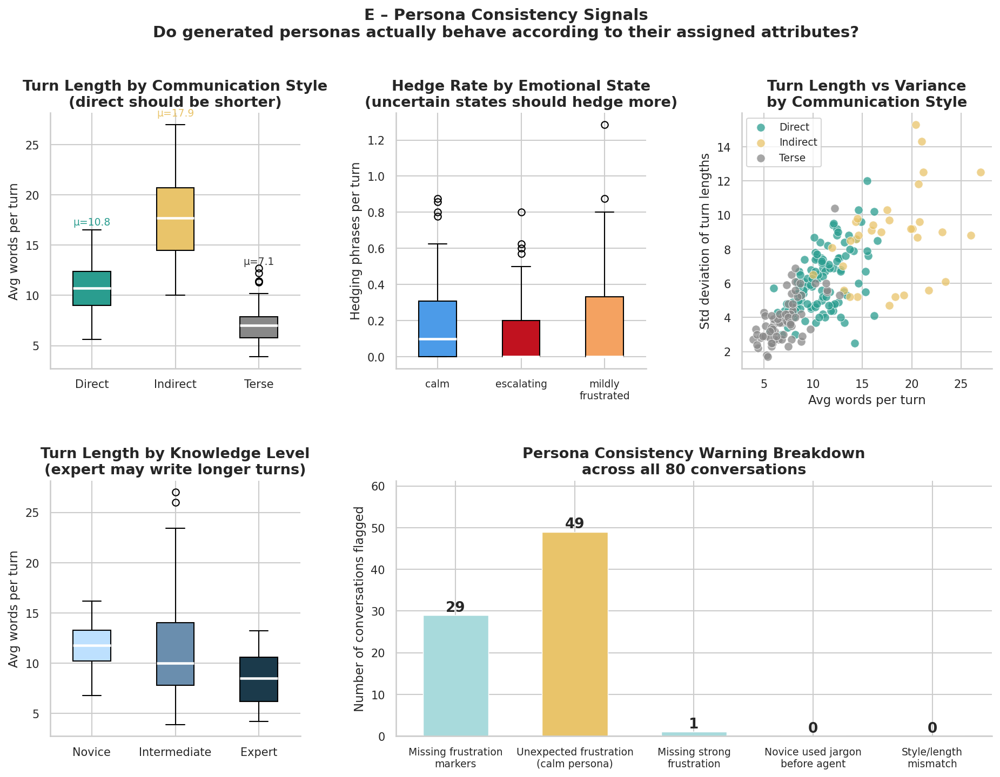

| Check | Flagged | % |
|-------|---------|---|
| Missing frustration markers (mildly_frustrated persona) | 29 | 13% |
| Unexpected frustration (calm persona) | 49 | 22% |
| Missing strong frustration (very_upset / escalating) | 1 | 0% |
| Novice customer used banking jargon before agent | 0 | 0% |
| Direct style but long turns (> 25 words avg) | 0 | 0% |
| Indirect style but very short turns (< 6 words avg) | 0 | 0% |

### 3G. Type-Specific Checks

Additional checks applied only to conversations of the relevant dataset type.

| Check | Type | Flagged | % |
|-------|------|---------|---|
| Dropout too early (< 3 turns) | `failure` | 0/70 | 0% |
| Dropout language absent from final turn | `failure` | 29/70 | 41% |
| Missing escalation arc (impatience/escalation_exit) | `failure` | 0/70 | 0% |
| Wrong prior belief absent from transcript | `type_a` | 0/40 | 0% |
| Prior belief silently dropped mid-conversation | `type_a` | 0/40 | 0% |
| Planted agent error not caught by customer | `type_b` | 8/31 | 26% |
| user_caught_error label mismatch vs transcript | `type_b` | 0/31 | 0% |

### 3H. Outlier Summary

Conversations with ≥ 3 warnings are flagged as outliers and are priority candidates for manual review or regeneration.

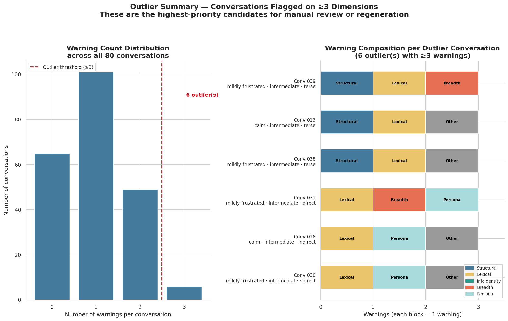

**6 outlier conversation(s)** out of 221:

| Conv | Warnings | Emotional State | Knowledge | Style | Warning Summary |
|------|----------|-----------------|-----------|-------|-----------------|
| 039 | 3 | mildly_frustrated | intermediate | terse | LOW_LENGTH_VARIANCE (stddev=2.5) · CERTAINTY_EXCEEDS_HEDGING (certainty=0.11, hedge=0.00) · BREADTH_FIRST_BUNDLING (max_ |
| 013 | 3 | calm | intermediate | terse | LOW_LENGTH_VARIANCE (stddev=2.8) · CERTAINTY_EXCEEDS_HEDGING (certainty=0.11, hedge=0.00) · DROPOUT_NOT_PLAUSIBLE — no [ |
| 038 | 3 | mildly_frustrated | intermediate | terse | LOW_LENGTH_VARIANCE (stddev=2.9) · CERTAINTY_EXCEEDS_HEDGING (certainty=0.10, hedge=0.00) · DROPOUT_NOT_PLAUSIBLE — no [ |
| 031 | 3 | mildly_frustrated | intermediate | direct | CERTAINTY_EXCEEDS_HEDGING (certainty=0.29, hedge=0.00) · BREADTH_FIRST_BUNDLING (max_cats=3, multi_cat_turns=2) · MISSIN |
| 018 | 3 | calm | intermediate | indirect | CERTAINTY_EXCEEDS_HEDGING (certainty=0.33, hedge=0.00) · UNEXPECTED_FRUSTRATION — persona is calm but found markers: ['l |
| 030 | 3 | mildly_frustrated | intermediate | direct | CERTAINTY_EXCEEDS_HEDGING (certainty=0.14, hedge=0.00) · MISSING_FRUSTRATION_MARKERS — persona is mildly_frustrated but  |

---

## 4. Layer 2 — LLM-as-Judge Evaluation

Each conversation is scored 1–5 on five behavioural dimensions by an LLM judge (**1 = clearly LLM-like, 5 = clearly human-like**), grounded in Wang et al. (2025), Mannekote et al. (2025), and Chen et al. (2024). Judge model: `claude-sonnet-4-6`.

### 4A. Score Distributions

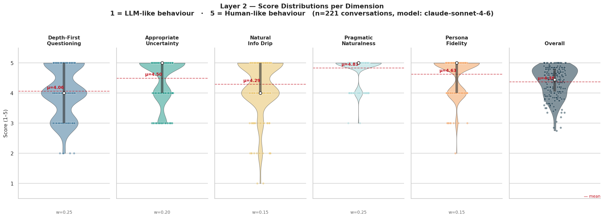

| Dimension | Mean | Min | Max | Stdev |
|-----------|------|-----|-----|-------|
| Depth-First Questioning | 4.06 | 2.0 | 5.0 | 0.82 |
| Appropriate Uncertainty | 4.50 | 3.0 | 5.0 | 0.71 |
| Natural Info Drip | 4.29 | 1.0 | 5.0 | 0.85 |
| Pragmatic Naturalness | 4.83 | 3.0 | 5.0 | 0.40 |
| Persona Fidelity | 4.63 | 2.0 | 5.0 | 0.58 |
| **Overall** | **4.38** | 2.8 | 5.0 | 0.49 |

**Weakest dimension:** Depth-First Questioning (μ = 4.06)  
**Strongest dimension:** Pragmatic Naturalness (μ = 4.83)

#### Type-Specific Dimension Scores

| Dimension | Type | Mean | Min | Max |
|-----------|------|------|-----|-----|
| Dropout Authenticity | `failure` | 3.71 | 1.0 | 5.0 |
| Prior Belief Coherence | `type_a` | 3.12 | 1.0 | 5.0 |
| Error Catch Quality | `type_b` | 3.94 | 1.0 | 5.0 |
| Pushback Naturalness | `type_b` | 4.52 | 1.0 | 5.0 |

### 4B. Scores by Persona Attribute

Heatmap showing which persona attribute combinations produce the lowest human-likeness scores — the hardest configurations to generate realistically.

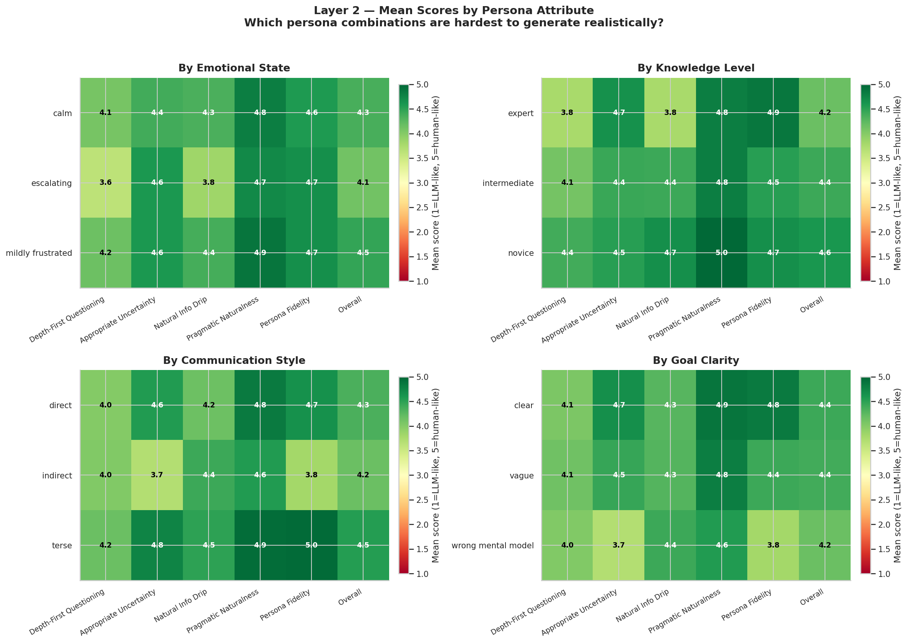

**Emotional State** — mean overall score by value:

| Value | Mean Overall | Weakest Dimension |
|-------|-------------|-------------------|
| `calm` | 4.35 | Depth-First Questioning (4.08) |
| `escalating` | 4.12 | Depth-First Questioning (3.62) |
| `mildly_frustrated` | 4.46 | Depth-First Questioning (4.15) |

**Knowledge Level** — mean overall score by value:

| Value | Mean Overall | Weakest Dimension |
|-------|-------------|-------------------|
| `expert` | 4.16 | Depth-First Questioning (3.78) |
| `intermediate` | 4.41 | Depth-First Questioning (4.10) |
| `novice` | 4.60 | Depth-First Questioning (4.38) |

**Communication Style** — mean overall score by value:

| Value | Mean Overall | Weakest Dimension |
|-------|-------------|-------------------|
| `direct` | 4.33 | Depth-First Questioning (4.01) |
| `indirect` | 4.16 | Appropriate Uncertainty (3.69) |
| `terse` | 4.54 | Depth-First Questioning (4.17) |

### 4C. Bottom Conversations — Priority Review List

The 15 lowest-scoring conversations by overall score. These are the top candidates for manual review or regeneration.

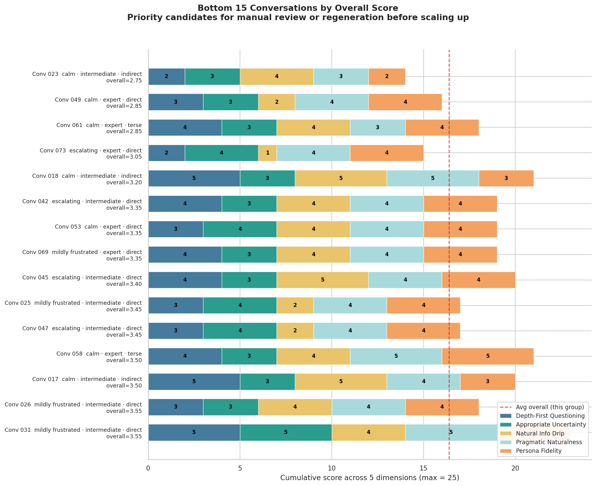

| Conv | Type | Overall | D | U | I | P | Pe | Standout Issue |
|------|------|---------|---|---|---|---|----|----------------|
| 023 | `success` | 2.75 | 2 | 3 | 4 | 3 | 2 | The second customer turn bundles three distinct concerns (dispute initiation, ca |
| 049 | `failure` | 2.85 | 3 | 3 | 2 | 4 | 4 | The conversation is classified as a failure/dropout but the customer fully compl |
| 061 | `failure` | 2.85 | 4 | 3 | 4 | 3 | 4 | 'correct. expecting provisional credit within 10 days' — no real caller phrases  |
| 073 | `success` | 3.05 | 2 | 4 | 1 | 4 | 4 | The opening turn front-loads all key facts and two separate requests (dispute +  |
| 018 | `type_b` | 3.20 | 5 | 3 | 5 | 5 | 3 | No planted agent error is present and the transcript ends before any adversarial |
| 042 | `failure` | 3.35 | 4 | 3 | 4 | 4 | 4 | The conversation is categorized as a failure/dropout but the customer fully achi |
| 053 | `failure` | 3.35 | 3 | 4 | 4 | 4 | 4 | The conversation is classified as a failure/dropout but the customer achieves ev |
| 069 | `failure` | 3.35 | 4 | 3 | 4 | 4 | 4 | The conversation is labelled a failure/dropout with no failure_mode, but the cus |
| 045 | `failure` | 3.40 | 4 | 3 | 5 | 4 | 4 | The conversation is labeled a failure/dropout but the customer's final message ( |
| 025 | `success` | 3.45 | 3 | 4 | 2 | 4 | 4 | All three key transaction facts (Amazon, $127.43, August 20th) are delivered in  |
| 047 | `success` | 3.45 | 3 | 4 | 2 | 4 | 4 | The customer front-loads all key transaction details (merchant, amount, date) in |
| 058 | `failure` | 3.50 | 4 | 3 | 4 | 5 | 5 | The conversation is labeled as a failure/dropout but the customer fully achieves |
| 017 | `type_a` | 3.50 | 5 | 3 | 5 | 4 | 3 | The 'wrong_mental_model' goal clarity and 'indirect' communication style are ent |
| 026 | `success` | 3.55 | 3 | 3 | 4 | 4 | 4 | The customer bundles the refund request and card cancellation into a single earl |
| 031 | `type_b` | 3.55 | 5 | 5 | 4 | 5 | 4 | The conversation is truncated — the customer never responds to the agent's plant |

> **D** = Depth-First  **U** = Uncertainty  **I** = Info Drip  **P** = Pragmatic  **Pe** = Persona Fidelity

### 4D. Radar Overview

Single-glance quality card: mean score per dimension broken out by emotional state. Outer edge = 5 (fully human-like).

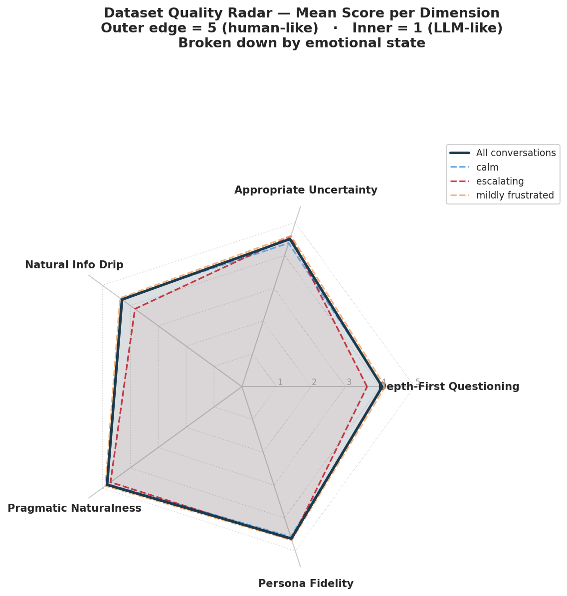

---

## 5. Layer 1 → Layer 2 Correlation

Validates whether the rule-based heuristics predict the LLM judge's behavioural scores. Strong correlation confirms the heuristics measure the same quality signals.

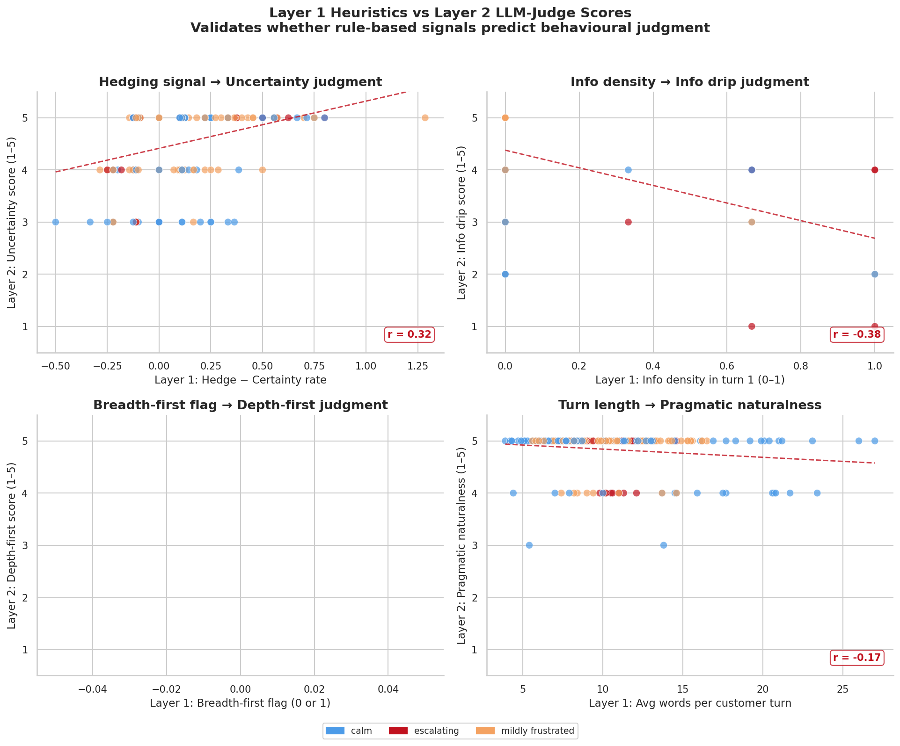

| Heuristic Pair | Pearson r | Interpretation |
|----------------|-----------|----------------|
| Hedge − Certainty → Uncertainty Score | 0.319 | Moderate positive |
| Info Density (L1) → Info Drip Score (L2) | -0.383 | Moderate negative |
| Avg Turn Length → Pragmatic Naturalness | -0.169 | Weak negative |

---

## 6. Metric Interpretation Guide

### Layer 1 — Rule-Based Signals

| Dimension | What it measures | LLM-like pattern |
|-----------|-----------------|------------------|
| **A – Structural** | Turn length and length variance | Very long turns (> 30 words), uniformly sized turns |
| **B – Lexical** | Hedging vs over-certainty language | Certainty rate > hedge rate for uncertain personas |
| **C – Info Density** | Facts volunteered in turn 1 | All 3 facts (merchant + amount + date) front-loaded |
| **D – Breadth-first** | Multi-concern bundling per turn | 3+ concern categories in one message |
| **E – Persona** | Emotional, knowledge, style consistency | Calm persona with frustration markers; novice using jargon |
| **F – Type-specific** | Dataset-type contracts | Failure dropout language absent; error not caught |

### Layer 2 — LLM Judge Dimensions (1 = LLM-like, 5 = Human-like)

| Score | Depth-First | Uncertainty | Info Drip | Pragmatic | Persona Fidelity |
|-------|------------|-------------|-----------|-----------|-----------------|
| **5** | One concern at a time, never bundles | Hedging matches scenario certainty | Reveals facts only when prompted | Sounds like a real caller | Assigned attributes clearly manifest |
| **3** | Occasional bundling | Mostly appropriate | Mixed — some proactive sharing | 1–2 formulaic turns | Some attributes present |
| **1** | Bundles dispute + card + refund in first message | Uncertain scenario but "I definitely didn't…" | All 3 facts front-loaded | Reads like a script | Persona is undetectable |

### Weighted Overall Score

The overall score is a weighted average of dimension scores. Weights vary by
dataset type (e.g. `failure` conversations weight **dropout_authenticity** more
heavily; `type_b` conversations weight **error_catch_quality** and
**pushback_naturalness**). See `eval_layer2.py → DIMENSION_WEIGHTS` for exact values.

### Action Thresholds

| Score Range | Recommendation |
|-------------|---------------|
| ≥ 4.0 | Publish / use as-is |
| 3.0 – 3.9 | Spot-check; acceptable for most purposes |
| 2.0 – 2.9 | Review and selectively regenerate |
| < 2.0 | Regenerate; systematic generation failure |
