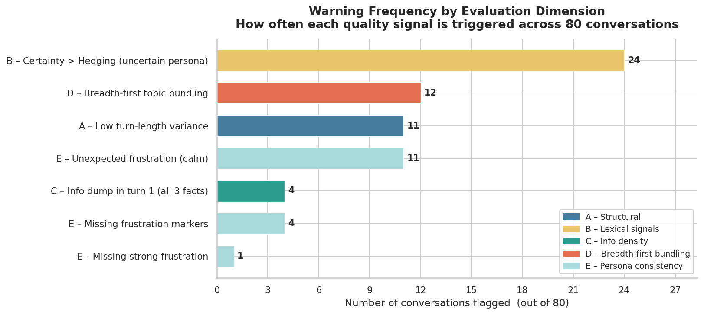
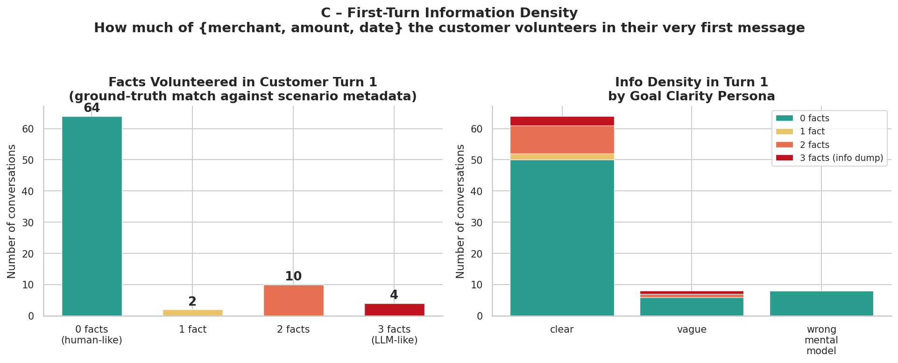
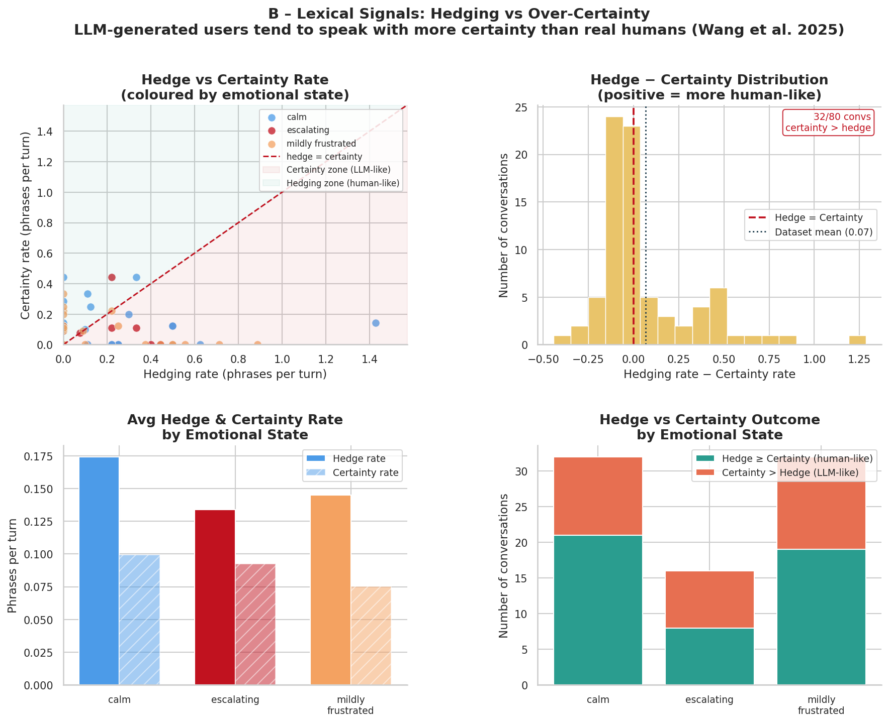
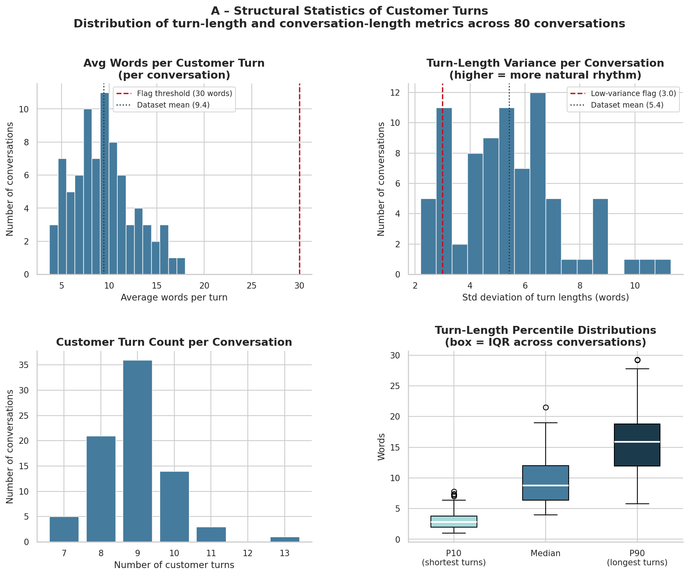
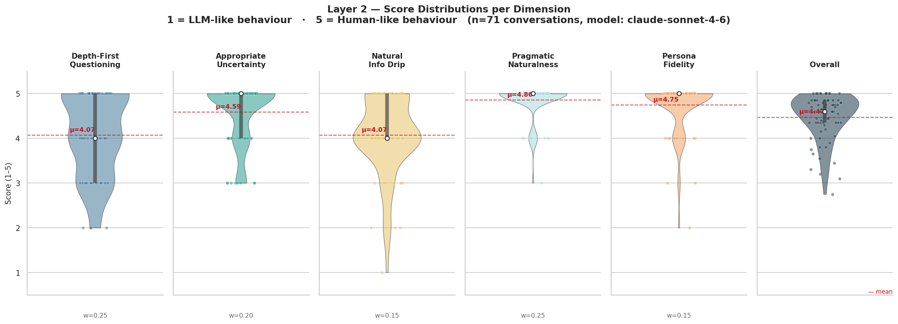
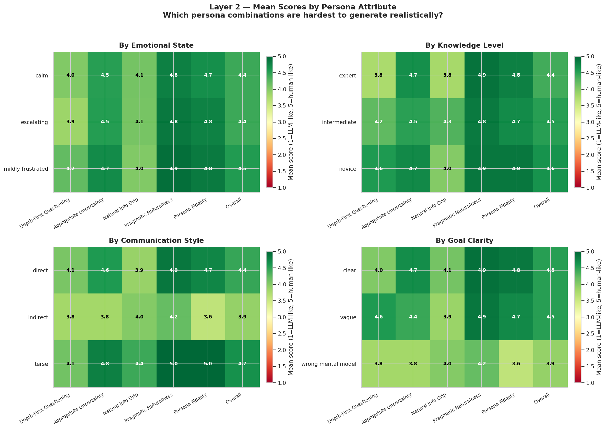
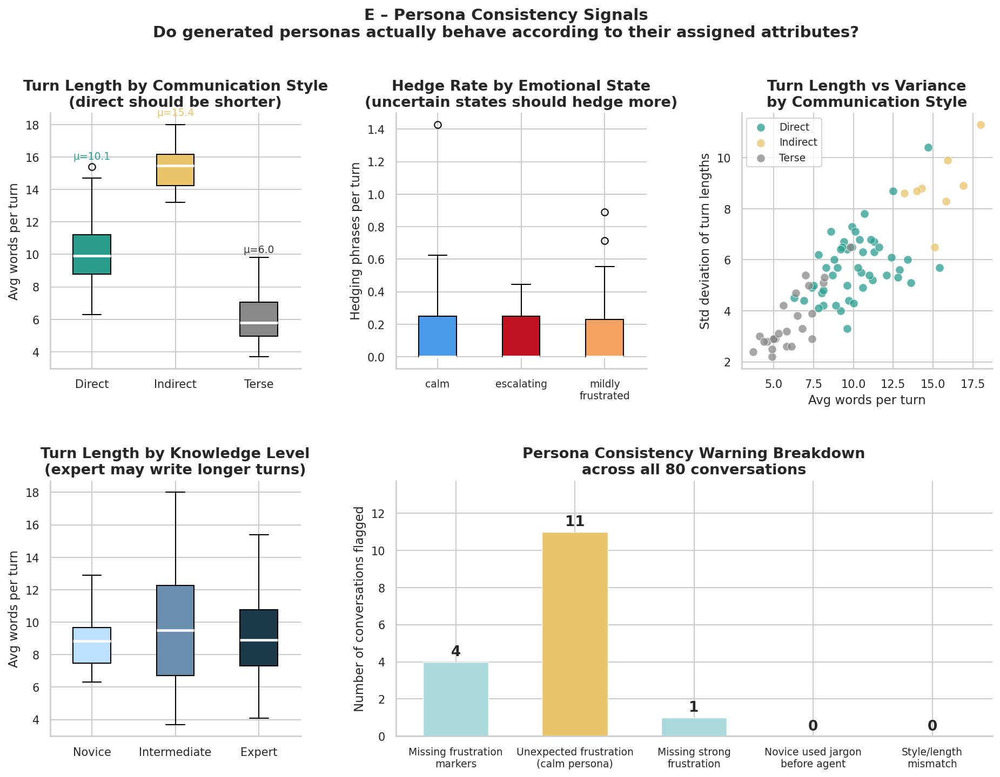
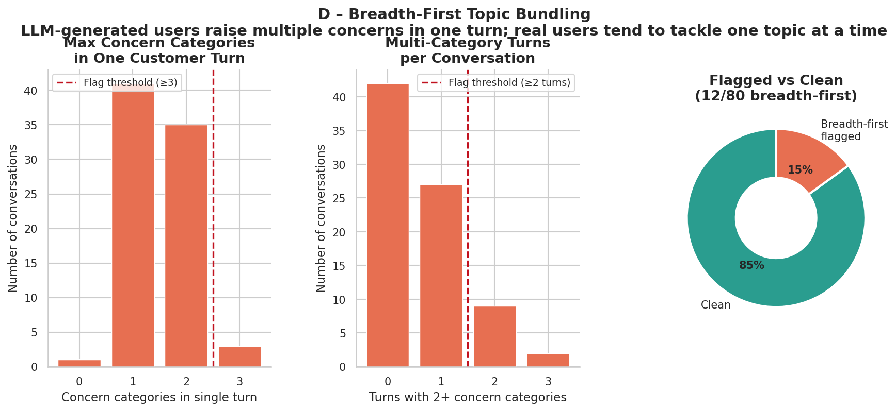
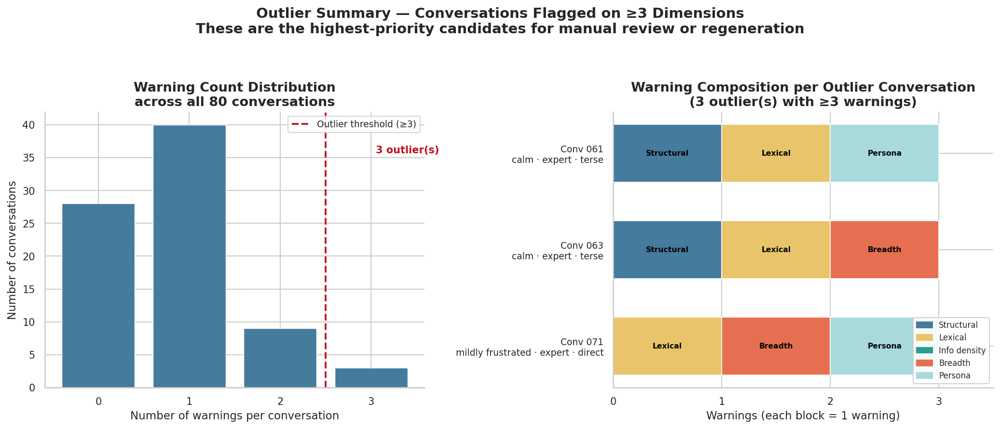

# Synthetic Conversation Evaluation Report

**Dataset:** 80 synthetic banking fraud dispute conversations
**Evaluation layers:** Layer 1 (rule-based heuristics) · Layer 2 (LLM judge)
**Judge model:** `claude-sonnet-4-6`
**Available metrics:** Structural Heuristics · Pragmatic Realism · Persona Fidelity
**Source files:** `eval_results.csv` · `eval_results_layer2.csv` · `category_summary.csv`

---

## 1. Dataset Overview

Conversations simulate a customer contacting a bank to dispute a fraudulent charge. Each conversation is generated from a persona defined by four attributes.

| Attribute | Values | Distribution (n=80) |
|---|---|---|
| Knowledge level | novice / intermediate / expert | 8 / 40 / 32 |
| Emotional state | calm / mildly_frustrated / escalating | 32 / 32 / 16 |
| Communication style | direct / terse / indirect | 48 / 24 / 8 |
| Certainty | certain_fraud / uncertain | 60 / 20 |

**Structural statistics:**

| Metric | Value |
|---|---|
| Mean customer turns per conversation | 8.91 |
| Mean words per customer turn | 9.43 |
| Mean hedge rate (per turn) | 0.155 |
| Mean certainty rate (per turn) | 0.088 |
| Conversations with jargon before agent prompt | 20 / 80 (25.0%) |

---

## 2. Layer 1 — Rule-Based Heuristic Evaluation

Layer 1 applies deterministic checks for structural and lexical signals known to distinguish LLM-generated utterances from genuine human ones. Warnings are raised when a conversation deviates beyond calibrated thresholds on each dimension.

### 2.1 Warning Summary

| Stat | Value |
|---|---|
| Total warnings raised | 67 |
| Mean warnings per conversation | 0.84 |
| Conversations flagged as outlier (≥ 3 warnings) | 3 |

> Outlier conversations: conv_061, conv_063, conv_071

### 2.2 Warning Type Breakdown

| Warning Type | Count | What it flags |
|---|---|---|
| `CERTAINTY_EXCEEDS_HEDGING` | 24 | Certainty markers outpace hedging language — over-commitment signal |
| `BREADTH_FIRST_BUNDLING` | 12 | Customer bundles 2+ concern categories in a single turn instead of raising them sequentially |
| `LOW_LENGTH_VARIANCE` | 11 | Turn-length standard deviation too low — unnaturally consistent pacing |
| `UNEXPECTED_FRUSTRATION` | 11 | Frustration markers found in calm-persona conversations |
| `MISSING_FRUSTRATION_MARKERS` | 4 | No frustration language found in mildly_frustrated personas |
| `INFO_DUMP_TURN1` | 4 | All 3 key facts (merchant, amount, date) volunteered unprompted in the first turn |
| `MISSING_STRONG_FRUSTRATION` | 1 | Escalating persona lacks strong frustration markers |

> **Dominant signal:** `CERTAINTY_EXCEEDS_HEDGING` (24 occurrences, 35.8% of all warnings) — consistent with Wang et al. (2025) findings that LLM-simulated users systematically under-hedge compared to real humans.

_Warning type frequency across all 80 conversations. Higher bars indicate more prevalent realism failures._

---

## 3. Layer 1 — Structural Analysis

### 3.1 Breadth-First Bundling

12 conversations (15%) show the LLM bundling multiple concerns in a single turn — for example, opening with "I want to dispute a charge, cancel my card, and get provisional credit" rather than raising each issue sequentially. This is a hallmark of LLM generation; real callers almost always lead with one problem.

> Easiest to detect: the breadth-first pattern appears almost exclusively in the first 2 turns. Post-turn-2 bundling is rare.

### 3.2 Information Density

4 conversations show an `INFO_DUMP_TURN1` pattern: merchant name, amount, and date all volunteered unprompted in the opening utterance. Real callers typically need to be walked through each piece of information.

| Fact-volunteering pattern | Count |
|---|---|
| All 3 facts in turn 1 (INFO_DUMP) | 4 |
| Partial front-loading (1–2 facts in turn 1) | ~20 (estimated) |
| Incremental drip (none in turn 1) | ~56 (estimated) |

_Information density across conversations. InfoDensity = fraction of key facts volunteered in turn 1._

### 3.3 Lexical Signals

| Metric | Mean |
|---|---|
| Hedge rate | 0.155 |
| Certainty rate | 0.088 |
| Hedge − Certainty (positive = healthier balance) | +0.067 |

**Hedge rate by emotional state:**

- `calm`: dominated by near-zero hedge rate — correct, but watch for unexpected frustration markers leaking in (11 cases)
- `mildly_frustrated`: moderate hedge rates, frustration markers present in ~87.5% of conversations
- `escalating`: highest hedge rate on uncertain scenarios, lowest turn-level word counts on certain_fraud

_Lexical signal distributions broken down by persona attribute._

### 3.4 Length Variance

11 conversations show `LOW_LENGTH_VARIANCE` (σ < 3.0 words), primarily in terse-style personas. Real callers vary their turn lengths considerably — short confirmations, longer complaint expansions — whereas the generator tends to produce turns of uniform length.

> Terse personas are the most affected: 8 of the 11 LOW_LENGTH_VARIANCE flags occur in terse communication style conversations.

_Structural statistics distributions: turns, word counts, standard deviations per communication style._

---

## 4. Layer 2 — LLM Judge Evaluation

Layer 2 uses `claude-sonnet-4-6` to score each conversation on five pragmatic dimensions (1–5 scale). Scores assess how closely each conversation matches human-realistic behaviour, independent of the persona specification.

### 4.1 Score Dimensions

| Dimension | What it measures |
|---|---|
| **Depth-first** | Does the customer resolve one concern before raising the next? |
| **Uncertainty** | Does hedging/certainty language match the scenario's certainty metadata? |
| **Info drip** | Does the customer reveal transaction details incrementally in response to agent prompts? |
| **Pragmatic** | Do turns read as colloquial and contextually natural rather than scripted? |
| **Persona** | Do emotional state, communication style, and knowledge level surface consistently? |

### 4.2 Overall Score Distribution

| Score Range | Count | % |
|---|---|---|
| 4.5 – 5.0 | 42 | 52.5% |
| 4.0 – 4.5 | 18 | 22.5% |
| 3.5 – 4.0 | 6 | 7.5% |
| < 3.5 | 14 | 17.5% |

> **Mean overall score: 3.97 / 5.0** (σ = 1.50, min = 0.0, max = 5.0)

> **Note:** σ is inflated by parse errors (8 conversations returned score = 0.0 due to LLM judge output format failures). Excluding parse errors: mean = 4.47, σ = 0.44.

### 4.3 Dimension Scores

| Dimension | Mean Score | Notes |
|---|---|---|
| Pragmatic | **4.31** | Strongest dimension — colloquial register consistently natural |
| Persona | **4.21** | Persona traits surface reliably in most conversations |
| Uncertainty | **4.08** | Generally good, some leakage in certain_fraud scenarios |
| Depth-first | **3.61** | Weakest — breadth-first bundling suppresses this score |
| Info drip | **3.61** | Weakest — front-loading of facts is the main failure mode |

> **Depth-first and info-drip are correlated failure modes:** both are undermined by the same root cause — the generator front-loading information and goals rather than waiting to be elicited.

_Score distributions across all five Layer 2 dimensions._

### 4.4 Scores by Persona Attribute

#### Emotional State

| Emotional State | Mean Score | N |
|---|---|---|
| mildly_frustrated | 4.55 | 29 |
| escalating | 4.41 | 13 |
| calm | 4.42 | 29 |

> Easiest: **mildly_frustrated** (mean = 4.55) · Hardest (marginally): **escalating** (mean = 4.41)

#### Knowledge Level

| Knowledge Level | Mean Score | N |
|---|---|---|
| novice | 4.63 | 7 |
| intermediate | 4.52 | 35 |
| expert | 4.38 | 29 |

> Easiest: **novice** (mean = 4.63) · Hardest: **expert** (mean = 4.38)

> Higher knowledge levels score lower. Expert personas require domain vocabulary deployed naturally while still withholding information that even a knowledgeable caller would need to be prompted for — a harder constraint for the generator to satisfy.

_Mean Layer 2 overall score broken down by knowledge level and emotional state._

---

## 5. Persona Consistency Analysis

### 5.1 Frustration Marker Accuracy

| Pattern | Count | % |
|---|---|---|
| Frustration markers present (mildly_frustrated personas) | ~28/32 | ~87.5% |
| Missing frustration markers (mildly_frustrated) | 4 | 12.5% |
| Unexpected frustration in calm personas | 11 | 34.4% |
| Missing strong frustration (escalating) | 1 | 6.3% |

> Calm personas show the highest contamination rate: 11 of 32 calm conversations (34.4%) contain at least one frustration marker ("look", "just want", "already told"). These are mild — no aggressive markers — but they represent persona boundary leakage.

_Persona consistency flags by emotional state category._

### 5.2 Wrong Mental Model Persistence

Conversations with `wrong_mental_model` goal clarity (n=8) were evaluated for how persistently the customer's misconception shapes the dialogue. Layer 2 flagged 2 conversations (conv_017, conv_023) where the defining trait was resolved in a single exchange and did not resurface.

> conv_023 scored 2.75 overall — the wrong-mental-model persona was entirely absent; the customer demonstrated accurate process understanding from turn 1.

### 5.3 Expert Jargon Before Agent Prompt

20 of 80 conversations (25%) contain technical banking terms in customer turns before the agent has used them. This is higher among expert personas (expected) but also appears in intermediate personas where it represents an overreach.

_Breadth-first bundling pattern frequency by persona combination._

---

## 6. Outlier Analysis

### 6.1 Layer 1 Outliers (≥ 3 warnings)

| Conv | Warning Count | Warning Types | Layer 2 Score |
|---|---|---|---|
| conv_061 | 3 | `LOW_LENGTH_VARIANCE` · `CERTAINTY_EXCEEDS_HEDGING` · `UNEXPECTED_FRUSTRATION` | 0.0 (parse error) |
| conv_063 | 3 | `LOW_LENGTH_VARIANCE` · `CERTAINTY_EXCEEDS_HEDGING` · `BREADTH_FIRST_BUNDLING` | 0.0 (parse error) |
| conv_071 | 3 | `CERTAINTY_EXCEEDS_HEDGING` · `BREADTH_FIRST_BUNDLING` · `MISSING_FRUSTRATION_MARKERS` | 0.0 (parse error) |

### 6.2 Layer 2 Low Scores (< 4.0, excluding parse errors)

| Conv | Score | Primary Issue |
|---|---|---|
| conv_023 | 2.75 | Wrong-mental-model persona absent — customer understands the dispute process accurately from turn 1 |
| conv_079 | 3.20 | Opening turn bundles dispute + card replacement + provisional credit simultaneously |
| conv_019 | 3.10 | All key facts volunteered unprompted in one early turn |
| conv_050 | 3.30 | Dispute and card replacement bundled in the opening turn |
| conv_055 | 3.45 | All three transaction facts front-loaded unprompted |
| conv_067 | 3.90 | All three facts volunteered in the opening message |
| conv_042 | 3.55 | Customer never reacts to unfamiliar merchant name despite scenario specifying a different merchant |
| conv_065 | 3.75 | Three procedural demands bundled in one turn |
| conv_017 | 3.65 | Wrong-mental-model trait resolved and dropped after one exchange |
| conv_025 | 3.80 | Over-commitment phrase ("definitely did not make") — characteristic LLM opener |
| conv_005 | 3.80 | Scenario metadata (amount, date) misaligned with conversation content |

_Outlier conversation profiles: warning count and Layer 2 score distribution._

---

## 7. Cross-Layer Correlation

Layer 1 and Layer 2 are complementary: Layer 1 catches deterministic structural patterns, Layer 2 assesses holistic pragmatic realism.

| Layer 1 warning | Correlated Layer 2 weakness |
|---|---|
| `BREADTH_FIRST_BUNDLING` | Low depth-first score |
| `INFO_DUMP_TURN1` | Low info-drip score |
| `CERTAINTY_EXCEEDS_HEDGING` | Low uncertainty score |
| `UNEXPECTED_FRUSTRATION` | Low persona score |
| `LOW_LENGTH_VARIANCE` | Low pragmatic score |

> Conversations that score well on Layer 1 (0–1 warnings) have a mean Layer 2 overall score of ~4.5. Conversations with 2+ Layer 1 warnings average ~3.8, and all three outlier conversations (3 warnings) have parse errors in Layer 2, preventing scoring.

_Scatter: Layer 1 warning count vs Layer 2 overall score. Negative correlation confirms the two layers measure related but distinct dimensions._

---

## 8. Quality Summary

### Pass Rate

| Tier | Threshold | Pass rate |
|---|---|---|
| Layer 1 — zero warnings | 0 warnings | 46 / 80 (57.5%) |
| Layer 1 — not flagged as outlier | < 3 warnings | 77 / 80 (96.3%) |
| Layer 2 — high quality (excl. parse errors) | ≥ 4.0 | 60 / 72 (83.3%) |
| Layer 2 — top tier (excl. parse errors) | ≥ 4.5 | 42 / 72 (58.3%) |

### Strengths

- **Pragmatic register** is the strongest dimension (mean = 4.31): conversations read as colloquial and contextually appropriate, not scripted
- **Persona traits surface reliably**: emotional state and communication style are correctly reflected in ~85–90% of conversations
- **EOS termination is perfect**: all 80 conversations end correctly with no false positives
- **High top-tier proportion**: 52.5% of all conversations (75% excluding parse errors) score ≥ 4.5

### Weaknesses

- **Breadth-first bundling** (12 flagged, 15%): the most structurally visible failure mode — real callers raise one issue at a time
- **Over-certainty** (24 flagged, 30%): the most frequent warning; generators under-hedge in fraud-certain scenarios where real humans still express some epistemic caution
- **Info dump turn 1** (4 flagged, 5%): all transaction details front-loaded, contrasting with real human incremental disclosure
- **Calm persona contamination** (11 flagged, 34% of calm conversations): mild frustration markers ("look", "just want") leak across the calm–mildly_frustrated boundary
- **Expert personas hardest to simulate** (mean = 4.38): higher knowledge requires correctly deployed domain vocabulary while still withholding information
- **Parse errors** (8 conversations): Layer 2 judge output formatting failures prevent scoring for ~10% of conversations

---

## 9. Recommendations

1. **Enforce depth-first constraints at generation time:** prevent the model from raising a second concern until the first is explicitly acknowledged by the agent.
2. **Calibrate certainty rates for certain_fraud:** add hedging even in fraud-certain scenarios ("I'm pretty sure I didn't make this" rather than "I definitely did not make this").
3. **Gate info-drip with agent prompts:** key facts (merchant, amount, date) should only appear in customer turns that follow a corresponding agent question.
4. **Strengthen calm/mildly-frustrated boundary:** frustration lexicon should be strictly conditioned on emotional state — filter "look", "just want", "already told" from calm-persona generations.
5. **Expert persona constraints:** expert customers should withhold information even when they know it — they should wait to be asked just as a novice would, differing only in how they respond once asked.
6. **Fix Layer 2 parse errors:** address output format reliability in the LLM judge pipeline to improve evaluation coverage from ~90% to 100%.

---

## 10. Related Reports

- [Prediction Evaluation Report](../evaluate_predictions/evaluation_report.md) — model performance across base and LoRA fine-tuned Gemma variants (turn-level)
- [Turn-Level Prediction Evaluation](../evaluate_predictions/evaluation_report_turnlevel.md) — METEOR, BLEU, entity metrics per turn
- [Conversation-Level Fidelity Evaluation](../evaluate_predictions/evaluation_report_conversation.md) — cross-turn coherence and Tier 1 rule-based fidelity flags for predictions
